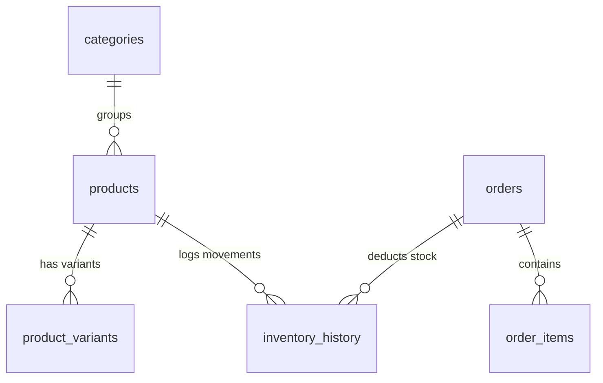

# Gopi Craft-Studio Database Architecture Guide

This document maps out the PostgreSQL database schema deployed on Supabase.

## 1. Tables and Purpose

- **admin_users**: Enforces auth logins and handles role-based permission settings (e.g. `super_admin`).
- **categories**: Product categories (e.g., Diya, Mandir, Urlis).
- **products**: Product record fields:
  - `price` (stored as JSON containing `amount` and `compareAt`).
  - `variants_definition` (JSON defining option names and value lists).
  - `stock_count`, `reserved_stock`, `low_stock_threshold`.
- **product_variants**: Specific option combinations (e.g. Color=Gold, Size=Medium) with custom SKU, price overrides, and variant-level stock counts.
- **shipping_rules**: Zones and charge parameters dynamically queried by states at checkout.
- **orders & order_items**: Stores buyer records, items, address, status, shipping charges, and totals.
- **inventory_history**: Records stock adjustments (e.g., checkout deductions, manually updated values, restocks).
- **activity_logs**: Administrative audit log of login events, category creations, theme publications, and CSV imports.
- **media_library**: Stored asset paths, file size metadata, and SEO alt texts.

---

## 2. Inventory & Stock Deductions Triggers
- When an order is submitted:
  - The stock levels are updated using server actions inside `lib/supabase/actions.ts`.
  - If a product variant is purchased, the variant's `stock_count` is decreased and recorded in `inventory_history`.
  - The main product's `stockCount` is synchronized to represent total combined stock.
  - If stock falls below `low_stock_threshold`, visual alerts (orange color indicators) light up in the admin control panel.
