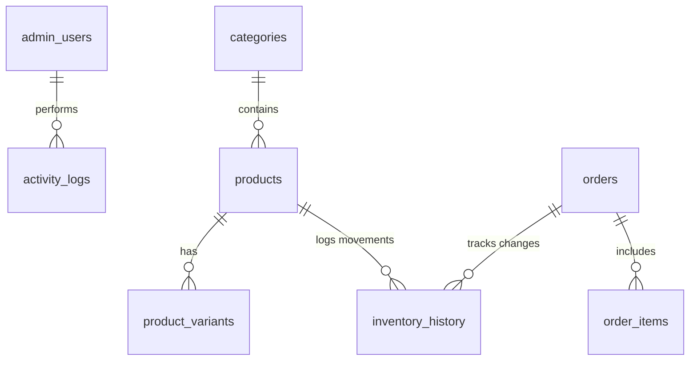

# Gopi Craft-Studio Database Schema Specification

This document maps out the entity-relationship design, relational tables, constraints, performance indexes, and database security layout deployed on Supabase.

---

## 1. Entity Relationship Diagram



---

## 2. Table Schemas & Data Constraints

### `admin_users`
Stores authenticated users authorized to access administrative tabs.
* `id` UUID (Primary Key, matches `auth.users.id` in Supabase Auth)
* `role` VARCHAR (e.g., `super_admin`, `admin`, `editor`)
* `created_at` TIMESTAMPTZ

### `categories`
Organizes the catalog into hierarchies (e.g. Diya, Mandir).
* `id` UUID (Primary Key)
* `slug` VARCHAR (Unique, Indexed)
* `name` VARCHAR NOT NULL
* `description` TEXT
* `image_url` TEXT
* `featured` BOOLEAN
* `parent_id` UUID (Foreign Key -> `categories.id` for nesting)

### `products`
The core catalog table.
* `id` UUID (Primary Key)
* `slug` VARCHAR (Unique, Indexed)
* `name` VARCHAR NOT NULL
* `price_amount` NUMERIC NOT NULL
* `price_compare_at` NUMERIC
* `images` JSONB (Array of `{src, alt}`)
* `category_id` UUID (Foreign Key -> `categories.id`)
* `sku` VARCHAR (Indexed)
* `stock_count` INTEGER
* `reserved_stock` INTEGER
* `low_stock_threshold` INTEGER
* `variants_definition` JSONB (Array of `{name, values}`)

### `product_variants`
Tracks specific variations of products.
* `id` UUID (Primary Key)
* `product_id` UUID (Foreign Key -> `products.id` ON DELETE CASCADE)
* `name` VARCHAR NOT NULL
* `options` JSONB NOT NULL (e.g. `{"Color": "Gold"}`)
* `sku` VARCHAR (Unique, Indexed)
* `price` NUMERIC (Variant override price)
* `stock_count` INTEGER
* `reserved_stock` INTEGER
* `low_stock_threshold` INTEGER

### `shipping_rules`
Wired to checkout calculated shipping states.
* `id` UUID (Primary Key)
* `zone_name` VARCHAR NOT NULL
* `regions` TEXT[] (Array of state codes e.g. `['MH', 'GJ']`)
* `base_charge` NUMERIC NOT NULL
* `free_shipping_min` NUMERIC
* `estimated_days` VARCHAR

### `orders` & `order_items`
Tracks buyer transactions.
* `orders.id` UUID (Primary Key)
* `orders.order_number` VARCHAR (Unique, Indexed)
* `orders.status` VARCHAR (e.g., `pending`, `confirmed`, `shipped`)
* `orders.shipping_address` JSONB (Address struct)
* `order_items.id` UUID (Primary Key)
* `order_items.order_id` UUID (Foreign Key -> `orders.id`)
* `order_items.product_id` UUID (Foreign Key -> `products.id`)
* `order_items.quantity` INTEGER

---

## 3. Database Indexes

To optimize checkout lookups and admin dashboard stats calculations, the following indexes are declared in `supabase/indexes.sql`:
```sql
CREATE INDEX IF NOT EXISTS idx_products_slug ON products(slug);
CREATE INDEX IF NOT EXISTS idx_products_category ON products(category_id);
CREATE INDEX IF NOT EXISTS idx_product_variants_sku ON product_variants(sku);
CREATE INDEX IF NOT EXISTS idx_orders_number ON orders(order_number);
CREATE INDEX IF NOT EXISTS idx_orders_status ON orders(status);
```
