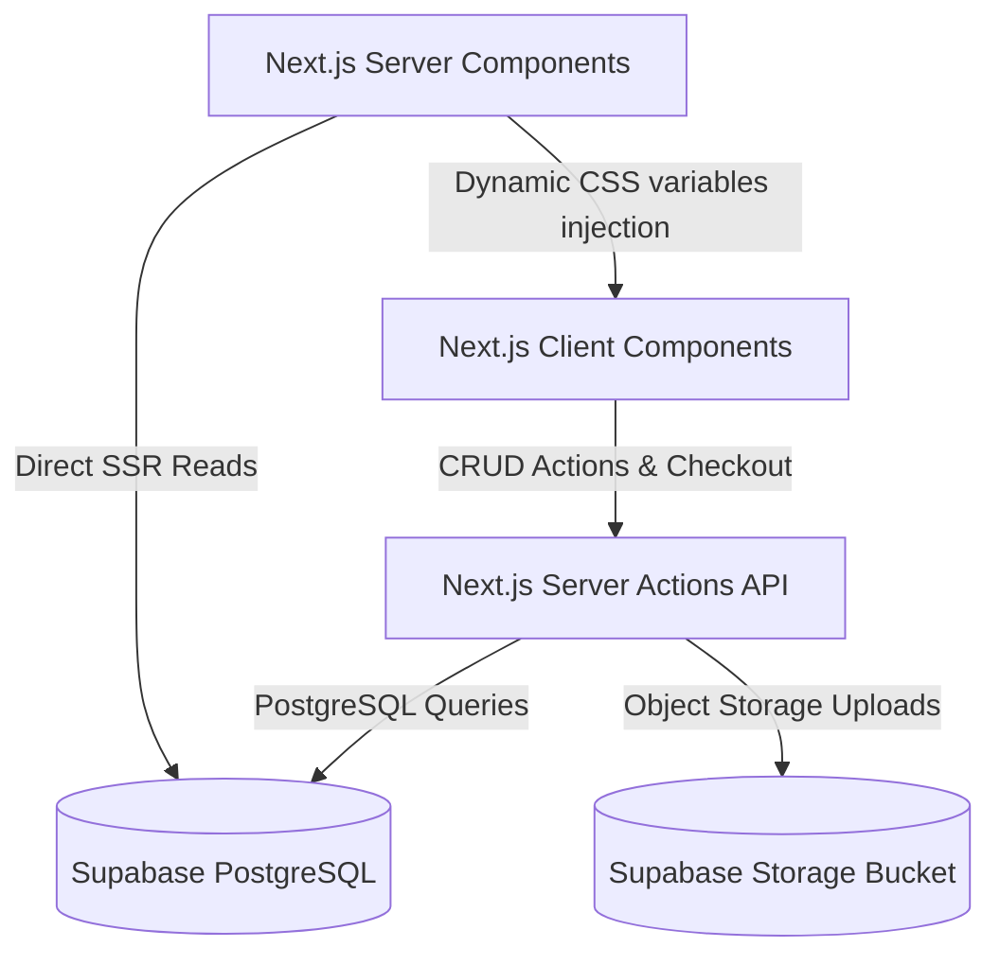

# Gopi Craft-Studio Project Architecture

This document details the software architecture, design patterns, and systems integration specifications for **Gopi Craft-Studio**.

---

## 1. System Topology & Data Flow

Gopi Craft-Studio is designed as a hybrid Server-Side Rendered (SSR) and Client-Side Hydrated web application leveraging **Next.js App Router** and **Supabase Backend-as-a-Service**.

### Flow Breakdown:
1. **Catalog Browsing**: Catalog pages (e.g., `/shop`, `/products/[slug]`) are pre-rendered at build time or updated incrementally via Incremental Static Regeneration (ISR). This delivers instant TTFB (Time to First Byte) to customers.
2. **Interactive Checkouts**: During cart validation and order placement, the checkout form calls secure Next.js Server Actions to calculate shipping fees, deduct stock, and register orders.
3. **Admin Dashboard**: The private `/admin` dashboard panel utilizes React state management for immediate visual feedback. It makes queries to Supabase using a client-side SDK instance verified by cookie authentication.

---

## 2. Rendering Strategy & ISR Mappings

To maximize web performance and SEO values, the platform enforces specific revalidation strategies per route:

| Route Path | Rendering Type | Revalidation / Cache Time |
| :--- | :--- | :--- |
| `/` (Homepage) | Static + Hydration | `revalidate = 3600` (1 hour) |
| `/shop` | Client-Side Hydrated | Dynamic |
| `/products/[slug]` | SSG + Dynamic Fetch | `revalidate = 3600` (1 hour) |
| `/blog` | SSG | `revalidate = 3600` (1 hour) |
| `/checkout` | Client Dynamic | `revalidate = 0` (Disabled) |
| `/admin` | Client Dynamic | `revalidate = 0` (Disabled) |
| `/admin/setup-wizard` | Client Dynamic | `revalidate = 0` (Disabled) |

---

## 3. UI/UX Styling & Animations Architecture

- **Theme Engine**: A global layouts template queries the active records from the `theme_settings` database table. These styling tokens (primary colors, border radius, fonts, accents) are injected onto the root document layout as custom CSS variables, letting the store owner change site cosmetics in real-time.
- **GSAP & Framer Motion**: All micro-interactions, scroll-triggered visual fades, and slide-in banners utilize Framer Motion (for structural transitions) and GSAP (for smooth, GPU-accelerated hero animations), strictly matching the site's luxury brand positioning.
- **Accessibility (WCAG AA)**: Interactive elements have minimum touch targets of 44x44px. ARIA roles and labels are bound to accordion components, modals, and dynamic variant selectors to ensure full screen-reader compliance.
